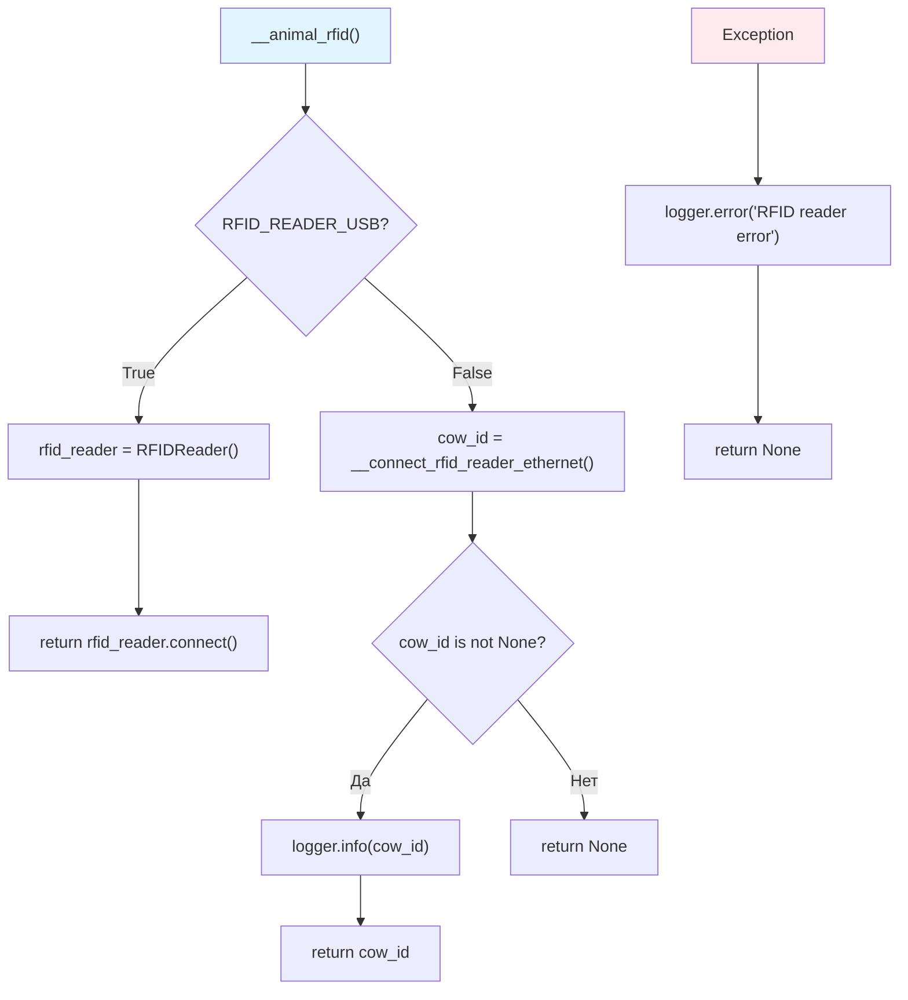

```mermaid
flowchart TD
    A["__animal_rfid()"] --> B{"RFID_READER_USB?"}
    B -->|True| C["rfid_reader = RFIDReader()"]
    B -->|False| D["cow_id = __connect_rfid_reader_ethernet()"]
    
    C --> E["return rfid_reader.connect()"]
    D --> F{"cow_id is not None?"}
    F -->|Да| G["logger.info(cow_id)"]
    F -->|Нет| H["return None"]
    
    G --> I["return cow_id"]
    
    J["Exception"] --> K["logger.error('RFID reader error')"]
    K --> L["return None"]
    
    style A fill:#e1f5fe
    style J fill:#ffebee
```