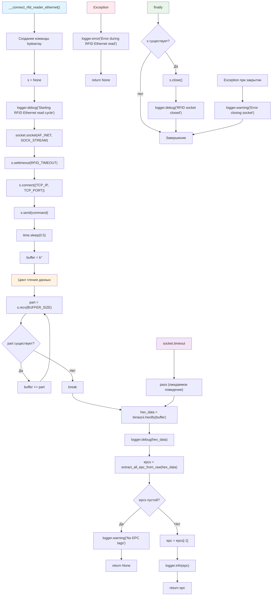

```mermaid
flowchart TD
    A["__connect_rfid_reader_ethernet()"] --> B["Создание команды bytearray"]
    B --> C["s = None"]
    C --> D["logger.debug('Starting RFID Ethernet read cycle')"]
    
    D --> E["socket.socket(AF_INET, SOCK_STREAM)"]
    E --> F["s.settimeout(RFID_TIMEOUT)"]
    F --> G["s.connect((TCP_IP, TCP_PORT))"]
    
    G --> H["s.send(command)"]
    H --> I["time.sleep(0.5)"]
    I --> J["buffer = b''"]
    
    J --> K["Цикл чтения данных"]
    K --> L["part = s.recv(BUFFER_SIZE)"]
    L --> M{"part существует?"}
    M -->|Да| N["buffer += part"]
    M -->|Нет| O["break"]
    
    N --> L
    O --> P["hex_data = binascii.hexlify(buffer)"]
    P --> Q["logger.debug(hex_data)"]
    Q --> R["epcs = extract_all_epc_from_raw(hex_data)"]
    
    R --> S{"epcs пустой?"}
    S -->|Да| T["logger.warning('No EPC tags')"]
    S -->|Нет| U["epc = epcs[-1]"]
    
    T --> V["return None"]
    U --> W["logger.info(epc)"]
    W --> X["return epc"]
    
    Y["socket.timeout"] --> Z["pass (ожидаемое поведение)"]
    Z --> P
    
    AA["Exception"] --> BB["logger.error('Error during RFID Ethernet read')"]
    BB --> CC["return None"]
    
    DD["finally"] --> EE{"s существует?"}
    EE -->|Да| FF["s.close()"]
    EE -->|Нет| GG["Завершение"]
    
    FF --> HH["logger.debug('RFID socket closed')"]
    HH --> GG
    
    II["Exception при закрытии"] --> JJ["logger.warning('Error closing socket')"]
    JJ --> GG
    
    style A fill:#e1f5fe
    style K fill:#fff3e0
    style Y fill:#f3e5f5
    style AA fill:#ffebee
    style DD fill:#e8f5e8
```