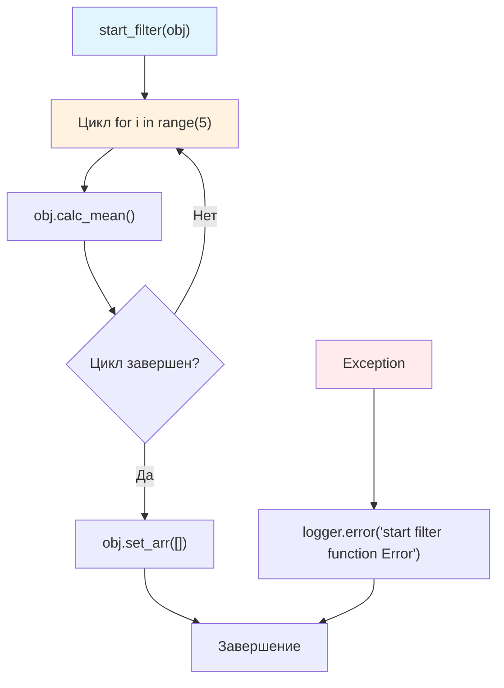

```mermaid
flowchart TD
    A["start_filter(obj)"] --> B["Цикл for i in range(5)"]
    B --> C["obj.calc_mean()"]
    C --> D{"Цикл завершен?"}
    D -->|Нет| B
    D -->|Да| E["obj.set_arr([])"]
    
    E --> F["Завершение"]
    
    G["Exception"] --> H["logger.error('start filter function Error')"]
    H --> F
    
    style A fill:#e1f5fe
    style B fill:#fff3e0
    style G fill:#ffebee
```