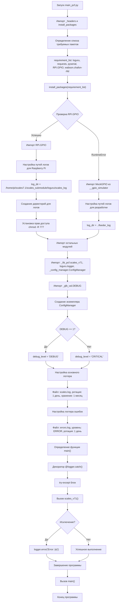

```markdown
# Flowchart: Main PCF Execution Process

This Mermaid flowchart illustrates the startup and execution flow of the main_pcf.py script, detailing the following key stages:

## Initialization
- Script starts by importing necessary headers and packages
- Defines a list of required packages (loguru, requests, pyserial, RPi.GPIO)
- Handles GPIO import with fallback to mock GPIO for non-Raspberry Pi environments

## Logging Configuration
- Sets up log directories based on environment (Raspberry Pi or development)
- Configures logging levels and log file management
  - Main log file: scales.log (daily rotation, 1-month retention)
  - Error log file: errors.log (ERROR level, daily rotation)

## Execution Flow
- Imports core modules and configuration manager
- Determines debug level based on DEBUG flag
- Defines main() function with error handling
- Calls scales_v71() as primary processing function
- Handles potential exceptions with logging

## Program Termination
- Gracefully handles successful execution or error scenarios
- Ensures proper program exit
```
