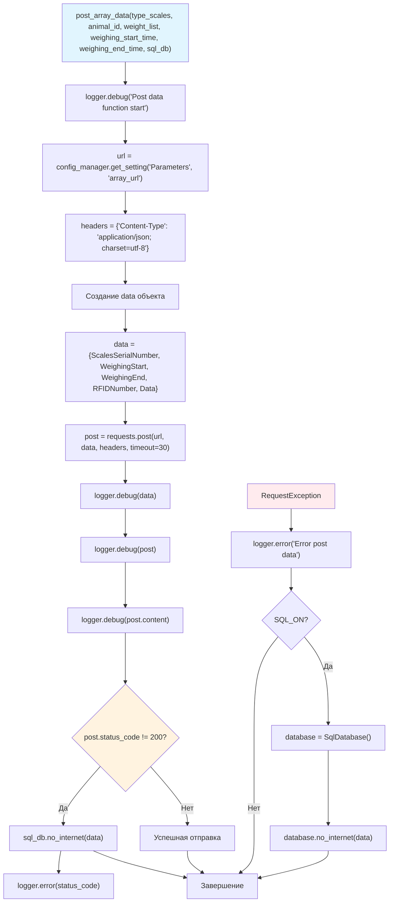

```mermaid
flowchart TD
    A["post_array_data(type_scales, animal_id, weight_list, weighing_start_time, weighing_end_time, sql_db)"] --> B["logger.debug('Post data function start')"]
    B --> C["url = config_manager.get_setting('Parameters', 'array_url')"]
    C --> D["headers = {'Content-Type': 'application/json; charset=utf-8'}"]
    
    D --> E["Создание data объекта"]
    E --> F["data = {ScalesSerialNumber, WeighingStart, WeighingEnd, RFIDNumber, Data}"]
    F --> G["post = requests.post(url, data, headers, timeout=30)"]
    
    G --> H["logger.debug(data)"]
    H --> I["logger.debug(post)"]
    I --> J["logger.debug(post.content)"]
    J --> K{"post.status_code != 200?"}
    
    K -->|Да| L["sql_db.no_internet(data)"]
    K -->|Нет| M["Успешная отправка"]
    
    L --> N["logger.error(status_code)"]
    L --> O["Завершение"]
    M --> O
    
    P["RequestException"] --> Q["logger.error('Error post data')"]
    Q --> R{"SQL_ON?"}
    R -->|Да| S["database = SqlDatabase()"]
    R -->|Нет| O
    
    S --> T["database.no_internet(data)"]
    T --> O
    
    style A fill:#e1f5fe
    style K fill:#fff3e0
    style P fill:#ffebee
```