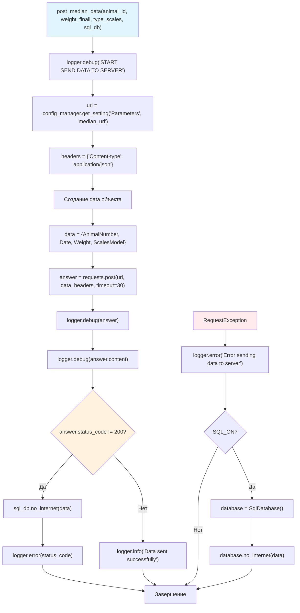

```mermaid
flowchart TD
    A["post_median_data(animal_id, weight_finall, type_scales, sql_db)"] --> B["logger.debug('START SEND DATA TO SERVER')"]
    B --> C["url = config_manager.get_setting('Parameters', 'median_url')"]
    C --> D["headers = {'Content-type': 'application/json'}"]
    
    D --> E["Создание data объекта"]
    E --> F["data = {AnimalNumber, Date, Weight, ScalesModel}"]
    F --> G["answer = requests.post(url, data, headers, timeout=30)"]
    
    G --> H["logger.debug(answer)"]
    H --> I["logger.debug(answer.content)"]
    I --> J{"answer.status_code != 200?"}
    
    J -->|Да| K["sql_db.no_internet(data)"]
    J -->|Нет| L["logger.info('Data sent successfully')"]
    
    K --> M["logger.error(status_code)"]
    M --> N["Завершение"]
    L --> N
    
    O["RequestException"] --> P["logger.error('Error sending data to server')"]
    P --> Q{"SQL_ON?"}
    Q -->|Да| R["database = SqlDatabase()"]
    Q -->|Нет| N
    
    R --> S["database.no_internet(data)"]
    S --> N
    
    style A fill:#e1f5fe
    style J fill:#fff3e0
    style O fill:#ffebee
```