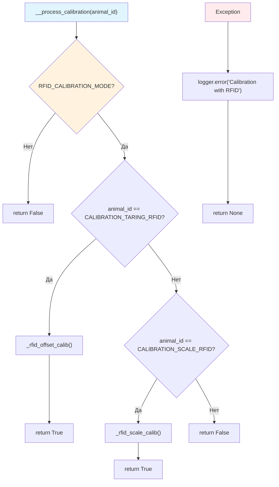

```mermaid
flowchart TD
    A["__process_calibration(animal_id)"] --> B{"RFID_CALIBRATION_MODE?"}
    B -->|Нет| C["return False"]
    B -->|Да| D{"animal_id == CALIBRATION_TARING_RFID?"}
    
    D -->|Да| E["_rfid_offset_calib()"]
    D -->|Нет| F{"animal_id == CALIBRATION_SCALE_RFID?"}
    
    E --> G["return True"]
    F -->|Да| H["_rfid_scale_calib()"]
    F -->|Нет| I["return False"]
    
    H --> J["return True"]
    
    K["Exception"] --> L["logger.error('Calibration with RFID')"]
    L --> M["return None"]
    
    style A fill:#e1f5fe
    style B fill:#fff3e0
    style K fill:#ffebee
```