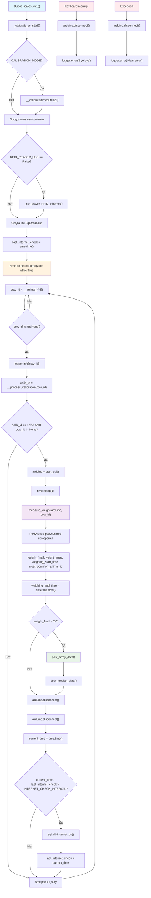

```mermaid
flowchart TD
    A["Вызов scales_v71()"] --> B["_calibrate_or_start()"]
    B --> C{"CALIBRATION_MODE?"}
    C -->|Да| D["__calibrate(timeout=120)"]
    C -->|Нет| E["Продолжить выполнение"]
    
    D --> E
    E --> F{"RFID_READER_USB == False?"}
    F -->|Да| G["_set_power_RFID_ethernet()"]
    F -->|Нет| H["Создание SqlDatabase"]
    
    G --> H
    H --> I["last_internet_check = time.time()"]
    I --> J["Начало основного цикла while True"]
    
    J --> K["cow_id = __animal_rfid()"]
    K --> L{"cow_id is not None?"}
    L -->|Нет| K
    L -->|Да| M["logger.info(cow_id)"]
    
    M --> N["calib_id = __process_calibration(cow_id)"]
    N --> O{"calib_id == False AND cow_id != None?"}
    
    O -->|Нет| P["Возврат к циклу"]
    O -->|Да| Q["arduino = start_obj()"]
    
    Q --> R["time.sleep(1)"]
    R --> S["measure_weight(arduino, cow_id)"]
    
    S --> T["Получение результатов измерения"]
    T --> U["weight_finall, weight_array, weighing_start_time, most_common_animal_id"]
    U --> V["weighing_end_time = datetime.now()"]
    
    V --> W{"weight_finall > '0'?"}
    W -->|Да| X["post_array_data()"]
    W -->|Нет| Y["arduino.disconnect()"]
    
    X --> Z["post_median_data()"]
    Z --> Y
    Y --> AA["arduino.disconnect()"]
    
    AA --> BB["current_time = time.time()"]
    BB --> CC{"current_time - last_internet_check > INTERNET_CHECK_INTERVAL?"}
    CC -->|Да| DD["sql_db.internet_on()"]
    CC -->|Нет| P
    
    DD --> EE["last_internet_check = current_time"]
    EE --> P
    P --> K
    
    FF["KeyboardInterrupt"] --> GG["arduino.disconnect()"]
    GG --> HH["logger.error('Bye bye')"]
    
    II["Exception"] --> JJ["arduino.disconnect()"]
    JJ --> KK["logger.error('Main error')"]
    
    style A fill:#e1f5fe
    style J fill:#fff3e0
    style S fill:#f3e5f5
    style X fill:#e8f5e8
    style FF fill:#ffebee
    style II fill:#ffebee
```