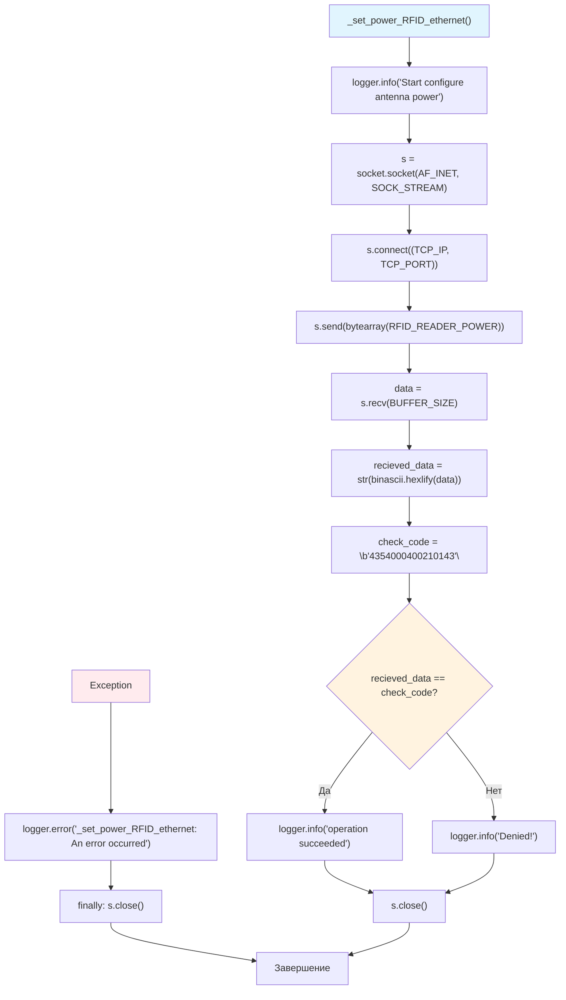

```mermaid
flowchart TD
    A["_set_power_RFID_ethernet()"] --> B["logger.info('Start configure antenna power')"]
    B --> C["s = socket.socket(AF_INET, SOCK_STREAM)"]
    C --> D["s.connect((TCP_IP, TCP_PORT))"]
    D --> E["s.send(bytearray(RFID_READER_POWER))"]
    
    E --> F["data = s.recv(BUFFER_SIZE)"]
    F --> G["recieved_data = str(binascii.hexlify(data))"]
    G --> H["check_code = \"b'4354000400210143'\""]
    
    H --> I{"recieved_data == check_code?"}
    I -->|Да| J["logger.info('operation succeeded')"]
    I -->|Нет| K["logger.info('Denied!')"]
    
    J --> L["s.close()"]
    K --> L
    
    M["Exception"] --> N["logger.error('_set_power_RFID_ethernet: An error occurred')"]
    N --> O["finally: s.close()"]
    O --> P["Завершение"]
    
    L --> P
    
    style A fill:#e1f5fe
    style I fill:#fff3e0
    style M fill:#ffebee
```