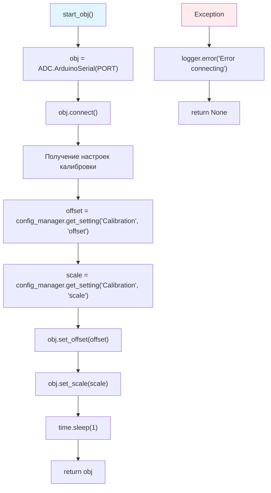

```mermaid
flowchart TD
    A["start_obj()"] --> B["obj = ADC.ArduinoSerial(PORT)"]
    B --> C["obj.connect()"]
    C --> D["Получение настроек калибровки"]
    D --> E["offset = config_manager.get_setting('Calibration', 'offset')"]
    E --> F["scale = config_manager.get_setting('Calibration', 'scale')"]
    
    F --> G["obj.set_offset(offset)"]
    G --> H["obj.set_scale(scale)"]
    H --> I["time.sleep(1)"]
    I --> J["return obj"]
    
    K["Exception"] --> L["logger.error('Error connecting')"]
    L --> M["return None"]
    
    style A fill:#e1f5fe
    style K fill:#ffebee
```